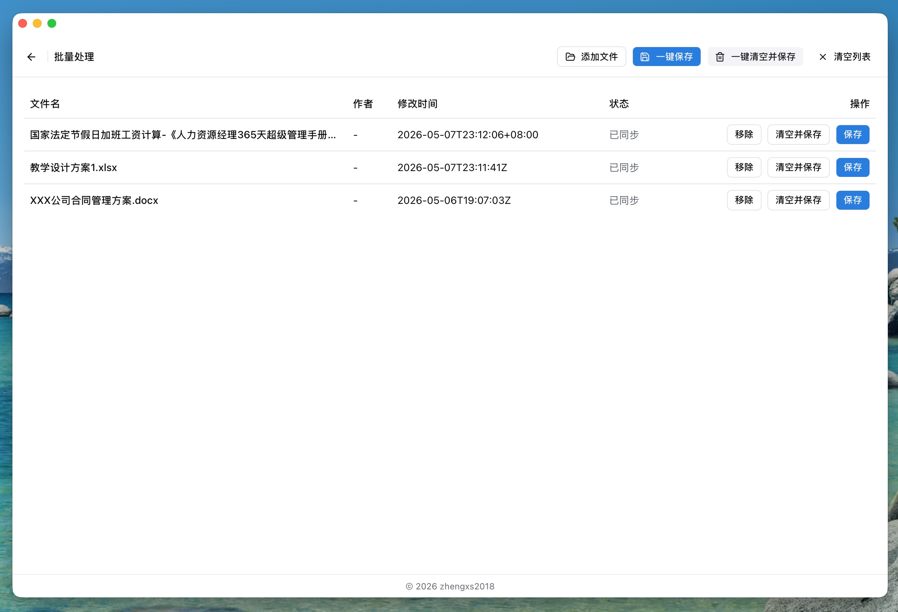

# Office 元数据编辑器

一个基于 Tauri 2 + React 19 的桌面应用，用于本地读取、编辑、清理和批量处理 Office/PDF 文档元数据。

## 功能概览

- 支持单文件编辑与批量处理
- 支持拖拽导入和文件选择导入
- 支持字段编辑、清空元数据、保存覆盖、另存为
- 所有处理在本地完成，不依赖外部服务

## 支持格式

- DOCX：直接读取与写入文档内元数据
- XLSX：直接读取与写入文档内元数据
- PDF：读取与写入 PDF Info 字典元数据

说明：DOC 属于兼容模式，保存行为稍有不同，请在使用前确认。

## 界面预览




## 本地开发

1. 开发环境要求
   - Node.js >= 24.14.0
   - pnpm >= 10
   - Rust（stable）
2. 安装依赖

   ```bash
   pnpm install
   pnpm start
   ```

## 构建

如果需要在 macOS 上交叉编译：

```bash
brew install nsis mingw-w64
pnpm build:win
```

根据自己的需求构建分发软件：

```bash
pnpm build:mac
pnpm build:win
```

## LICENSE

MIT
