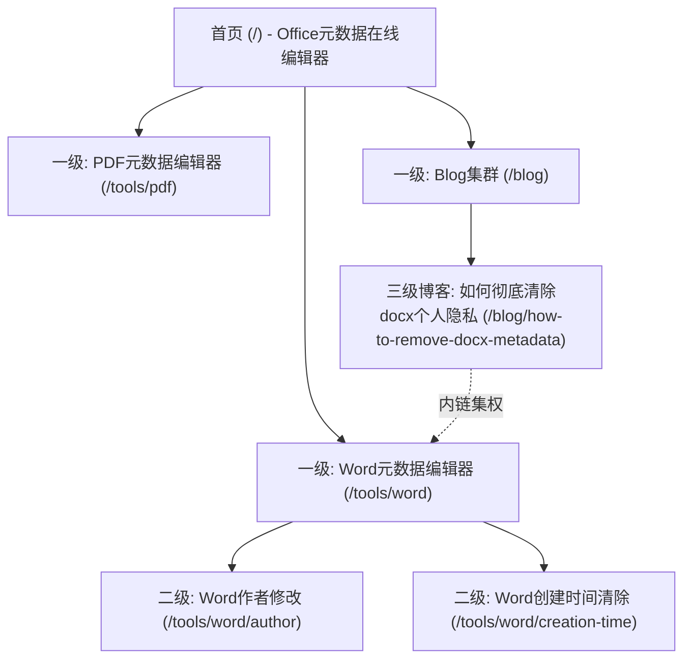

# 未上线网站 SEO / TDK 代码补全方案

## 0. 文档定位

本文档用于指导 **Office 元数据编辑器 (office-metadata-editor)** 这一未上线网站项目在代码层与内容层补齐 SEO 基础能力。
本文档将 **r.md (SEO 实战心得)** 中的核心经验（层级规则、关键词准入、内容集群、权重分发、多语言防降权、外链与锚文本规范）深度对齐并融入到技术落地方案中，建立一套可维护、可校验、可持续扩展的 **SEO Contract (SEO 契约)**。

---

## 1. 核心原则（实战对齐）

### 1.1 页面是否允许上线（硬性准入门槛）

所有页面上线前必须经过严格价值评估，禁止单纯为了产品型号、无搜索量参数批量生成页面。
在代码层，只有满足以下契约的页面才允许将 `indexable` 设为 `true`：

```txt
页面是否允许上线 =
  有明确搜索词（通过 Ahrefs/Semrush 查询有明确搜索量）
  + 关键词工具能跑出相关的长尾关键词建议
  + 搜索意图一致（Google 前 10 名结果的页面类型多数与我们规划的一致）
  + 能承接主页面，或能作为下沉内容对上级页面做补充
```

> **[!WARNING] 无价值页面稀释权重**
> 无对应搜索词、无内链、无合理规划的纯参数页面 100% 是垃圾页面，只会严重稀释全站权重。对于这些页面，代码层必须设为 `indexable: false` (即 `noindex`)。

### 1.2 新站关键词准入难度指标（KD & 黄金得分）

新站上线前 6 个月，为了能快速排上首页，必须严格筛选关键词。只有同时满足以下三个技术难度的词，才做独立页面：

| 评估维度 | 衡量指标 | 新站准入标准 | 实战含义 |
| :--- | :--- | :--- | :--- |
| **Ahrefs KD** | 排名前 1-20/30 页面的外链数量 | **KD < 10** | 保证不依赖外链即可获得初始排名 |
| **Semrush KD** | 内容质量与页面结构难度 | **KD < 20** | 保证仅靠优秀的内容结构就能上首页 |
| **Allintitle 黄金得分** | 谷歌中直接竞争对手的数量 | **黄金得分 < 10** | 避开红海词，专攻蓝海长尾词 |

* **混合意图词策略**：同时具备信息类（Informational）和交易类（Transactional）属性的词，**只能做内容聚合页**，不能单纯做产品页或写博客。
* **长尾词处理**：低流量长尾词、变体词、同义词**直接写进对应的上级页面**（作为 H3/H4），**不做独立页面**，避免内部竞争。
* **蓝海转化词**：除了工具挖掘，还要从推特（Twitter）、Reddit 等平台挖掘用户真实痛点（例如：*“How to remove original author from docx without Word”*），第一批高意向询盘/用户往往由此产生。

---

## 2. 页面层级与路由规划（三层结构）

### 2.1 三层结构原则

99% 的行业最多只能用 3 层页面结构（一级 → 二级 → 三级），层级越深，权重流失越严重。



### 2.2 针对本项目 (office-metadata-editor) 的路由推荐

本项目属于典型的 **C端与工具类混合网站**，核心流量获取依赖“**纯内容/工具驱动 (70%内容 + 30%品牌)**”。路由应极其扁平化：

* **首页**：`/`（综合 Office 元数据编辑工具，提供即时在线上传编辑体验）
* **一级工具聚合页**：按文档格式划分（二级页面只能按“原理不同”或“格式不同”划分，且必须有明确搜索量）：
  * `/tools/word` (Word 元数据修改)
  * `/tools/excel` (Excel 属性清除)
  * `/tools/pdf` (PDF 属性编辑)
* **二级长尾工具/功能页**：
  * `/tools/word/author` (修改Word作者)
  * `/tools/pdf/clean` (彻底清除PDF元数据)
* **博客集群页**：
  * `/blog` (博客首页)
  * `/blog/[slug]` (具体的技巧与痛点解决方案博客，如 `/blog/remove-original-author-docx`)

---

## 3. SEO 页面 Contract (TS 类型契约)

在 `src/seo/seo-types.ts` 中定义严格的页面契约，要求所有页面组件在声明 metadata 时，必须声明其背后的 SEO 属性，以便于自动化 check。

```ts
// src/seo/seo-types.ts

export type SeoIntent =
  | 'transactional' // 交易类 (如：在线编辑/下载)
  | 'commercial'    // 商业意图 (如：比对工具)
  | 'informational' // 信息类 (如：如何清除元数据)
  | 'mixed';        // 混合意图

export type SeoPageType =
  | 'home'          // 首页
  | 'category'      // 一级分类/聚合页
  | 'tool-detail'   // 细节工具页
  | 'blog-hub'      // 博客首页
  | 'blog-post'     // 博客文章 (下沉内容)
  | 'faq';          // 常见问题解答页

export interface SeoPageContract {
  /**
   * 页面唯一标识 (如 'home', 'tool.word', 'blog.remove-author')
   */
  pageCode: string;

  /**
   * 实际路由路径 (例如 '/tools/word')
   */
  path: string;

  /**
   * 页面层级：1 / 2 / 3 (严格限制不得超过 3)
   */
  level: 1 | 2 | 3;

  /**
   * 页面类型
   */
  pageType: SeoPageType;

  /**
   * 主关键词 (必须有明确搜索量)
   */
  primaryKeyword: string;

  /**
   * 新站关键词硬性指标校验
   */
  keywordMetrics?: {
    ahrefsKd: number;      // 必须 < 10 (新站首期)
    semrushKd: number;     // 必须 < 20
    goldenScore: number;   // 必须 < 10 (黄金得分)
  };

  /**
   * 次要关键词 / 变体词 / 同义词 (应合理融入正文和 H3/H4，不做独立页面)
   */
  secondaryKeywords: string[];

  /**
   * 搜索意图
   */
  intent: SeoIntent;

  /**
   * Google 前 10 名主流页面类型 (用以决定我们是否用此页面类型竞争)
   */
  serpPageType: SeoPageType;

  /**
   * 页面是否允许被搜索引擎索引
   */
  indexable: boolean;

  /**
   * 父级页面 pageCode，用以自动生成 Breadcrumbs (面包屑) 和内链导航
   */
  parentPageCode?: string;

  /**
   * 页面 Title (包含主关键词，限制 60 字符内，不得堆叠)
   */
  title: string;

  /**
   * 页面 Description (吸引点击，限制 160 字符内，禁写成关键词列表)
   */
  description: string;

  /**
   * keywords 仅用作内部关键词地图和管理，不堆砌在前端页面
   */
  keywords?: string[];

  /**
   * 页面主 H1 (必须有且仅有一个，包含主关键词)
   */
  h1: string;

  /**
   * Canonical URL (多语言指向自身，拒绝跨语言乱指)
   */
  canonical: string;

  /**
   * 多语言 alternate 映射 (真实人工翻译，拒绝 100+ 语言机器生成)
   */
  alternates?: Record<string, string>;

  /**
   * Open Graph / Twitter 分享契约
   */
  og?: {
    title: string;
    description: string;
    image: string;
  };

  /**
   * JSON-LD 结构化数据类型
   */
  schemaTypes?: Array<
    | 'Organization'
    | 'WebSite'
    | 'BreadcrumbList'
    | 'Product'
    | 'FAQPage'
    | 'Article'
    | 'ItemList'
  >;

  /**
   * 核心内链指向：当前页面必须用锚文本链接到的一级核心落地页 pageCode
   */
  internalLinksTo: string[];

  /**
   * PAA (People Also Ask) 用户常问问题
   * 强制要求：必须全部提取并在正文以 H3/H4 的形式逐一解答
   */
  paaQuestions?: string[];

  /**
   * 页面开发/编辑状态
   */
  status: 'draft' | 'ready' | 'published';
}
```

---

## 4. TDK 编写规范与实战避坑

### 4.1 Title 规范
* **公式**：`主关键词 + 场景/核心痛点解决方案 | 品牌名`
* **Word 页面示例**：`Edit Word Metadata Online: Remove Authors & Tracked Info | Brand`
* **PDF 页面示例**：`PDF Metadata Editor: Clear PDF Properties & Author Online | Brand`
* **约束**：
  1. 每个页面 Title 必须全球唯一，禁止套用完全一致的批量模板。
  2. 控制在 **50-60 个字符** 之间。
  3. H1 标签和 Title 保持意思一致，但**严禁字面完全重复**（Title 是面向搜索结果的，H1 是面向页内的）。

### 4.2 Description 规范
* **公式**：`解决什么用户的什么痛点 + 我们的核心工具优势 + 行动引导 (CTA)`
* **Word 页面示例**：`Worried about document privacy? Upload and edit Word docx metadata online. Easily delete creator names, modification dates, and hidden authors in 1-click.`
* **约束**：
  1. 绝对不能写成简陋的关键词堆叠列表。
  2. 限制在 **120-150 个字符** 内，以防 Google 搜索结果中被截断。

### 4.3 PAA (People Also Ask) 强绑定
所有在 `r.md` 和关键词调研中提取出来的 PAA 问题，代码和内容中必须这样落地：
* 设为页面的 `paaQuestions`，如 `["Can someone see if I changed metadata in Word?", "Does converting Word to PDF clear metadata?"]`。
* 在页面底部编写 FAQ 区块，**使用 H3/H4 标签包围这些问题，并在下方给出自然、流畅的专业解答**。
* 在页面中注入 `FAQPage` 结构化数据（JSON-LD）。

---

## 5. Next.js App Router 落地实现代码

### 5.1 统一 Metadata 生成器

```ts
// src/seo/generate-seo-metadata.ts
import type { Metadata } from 'next';
import { seoMap } from './seo-map';

const SITE_URL = 'https://www.officemetadata.com';
const SITE_NAME = 'OfficeMetadataEditor';

export function generateSeoMetadata(pageCode: string): Metadata {
  const seo = seoMap[pageCode];

  if (!seo || seo.status !== 'published') {
    return {
      title: `${SITE_NAME} - Free Online Office Metadata Tools`,
      robots: {
        index: false,
        follow: false,
      },
    };
  }

  const canonicalUrl = `${SITE_URL}${seo.canonical}`;

  return {
    title: seo.title,
    description: seo.description,
    keywords: seo.keywords,

    alternates: {
      canonical: canonicalUrl,
      languages: seo.alternates ? Object.fromEntries(
        Object.entries(seo.alternates).map(([lang, path]) => [lang, `${SITE_URL}${path}`])
      ) : undefined,
    },

    robots: {
      index: seo.indexable,
      follow: seo.indexable,
      googleBot: {
        index: seo.indexable,
        follow: seo.indexable,
      },
    },

    openGraph: {
      title: seo.og?.title ?? seo.title,
      description: seo.og?.description ?? seo.description,
      url: canonicalUrl,
      siteName: SITE_NAME,
      images: seo.og?.image ? [seo.og.image] : [`${SITE_URL}/og-default.png`],
      type: seo.pageType === 'blog-post' ? 'article' : 'website',
    },

    twitter: {
      card: 'summary_large_image',
      title: seo.og?.title ?? seo.title,
      description: seo.og?.description ?? seo.description,
      images: seo.og?.image ? [seo.og.image] : [`${SITE_URL}/og-default.png`],
    },
  };
}
```

### 5.2 Next.js App Router 路由页面使用示例

```tsx
// app/tools/word/page.tsx
import { generateSeoMetadata } from '@/seo/generate-seo-metadata';
import { JsonLd } from '@/seo/json-ld';
import { generateJsonLd } from '@/seo/generate-json-ld';
import { RelatedLinks } from '@/seo/components/RelatedLinks';

// 1. 动态生成符合 Contract 的 TDK 和元数据
export async function generateMetadata() {
  return generateSeoMetadata('tool.word');
}

export default function WordToolPage() {
  // 2. 动态生成结构化数据 (Organization, Product, FAQPage)
  const jsonLdData = generateJsonLd('tool.word');

  return (
    <main className="max-w-6xl mx-auto px-4 py-8">
      {/* 结构化数据注入 */}
      <JsonLd data={jsonLdData} />

      {/* 核心 SEO H1 (页面有且仅能有一个) */}
      <h1 className="text-3xl font-extrabold text-slate-900 mb-6">
        Online Word Metadata Editor & Cleaner
      </h1>

      {/* 核心在线工具交互区 (主逻辑) */}
      <section className="bg-white rounded-xl shadow-lg p-6 mb-12">
        {/* Office Metadata 编辑器前端组件 */}
      </section>

      {/* PAA / FAQ 模块落地为 H3/H4 */}
      <section className="prose prose-slate max-w-none mb-12">
        <h2 className="text-2xl font-bold">Frequently Asked Questions</h2>
        
        <div className="space-y-6 mt-6">
          <div className="faq-item">
            <h3 className="text-lg font-semibold text-slate-800">
              Can someone see if I changed the metadata in Word?
            </h3>
            <p className="text-slate-600 mt-2">
              No. Once you edit or strip metadata from a DOCX file using our editor, the previous fields (such as original author, creation date, and revision history) are permanently overwritten or removed. The file appears brand new.
            </p>
          </div>
          
          <div className="faq-item">
            <h3 className="text-lg font-semibold text-slate-800">
              Does converting Word to PDF clear original metadata?
            </h3>
            <p className="text-slate-600 mt-2">
              Not necessarily. Converting DOCX to PDF often transfers existing metadata, such as the document's original creator and company, into the PDF's fields. It is safer to clean metadata prior to conversion or use our PDF Metadata Cleaner directly.
            </p>
          </div>
        </div>
      </section>

      {/* 核心内链集权组件，回流权重给其他一级/二级页面 */}
      <footer className="border-t pt-8">
        <RelatedLinks currentPageCode="tool.word" />
      </footer>
    </main>
  );
}
```

---

## 6. 内链集权与首页布局规范

根据 `r.md` 的实战建议，**内链是页面权重分配的生命线**。为了在新站快速提升特定落地页权重，代码与布局需满足以下内链设计：

### 6.1 页面权重回流三大法则：

1. **下沉博客必须 100% 回流**：所有的相关博客文章，必须有硬性内链指向对应的**核心落地页**（例如关于Word的所有文章都用锚文本 `"Word Metadata Editor"` 链接到 `/tools/word`）。
2. **聚合页是流量长期核心**：博客流量是短期的，长期核心是 `/tools/word` 这种工具聚合页，博客集群必须不断向聚合页输送权重。
3. **首页正文区域（极其重要）核心分发**：
   * **绝对不能只在导航栏（Header）和页脚（Footer）加链接！**
   * **必须在首页的首屏正文区域或显眼的卡片组中，直接把核心一级落地页（Word、Excel、PDF 编辑器页面）展示出来**。
   * 当我们为首页做外链时，首页流进来的域名权重会自动通过正文黄金位置的内链高效分发给这些核心页面。

### 6.2 自动内链推荐组件

```tsx
// src/seo/components/RelatedLinks.tsx
import Link from 'next/link';
import { seoMap } from '../seo-map';

export function RelatedLinks({ currentPageCode }: { currentPageCode: string }) {
  const currentSeo = seoMap[currentPageCode];
  if (!currentSeo || !currentSeo.internalLinksTo.length) return null;

  return (
    <div className="related-links py-6 bg-slate-50 rounded-lg p-6">
      <h4 className="text-sm font-semibold text-slate-700 mb-3">Related Utility Tools</h4>
      <div className="flex flex-wrap gap-4">
        {currentSeo.internalLinksTo.map((targetCode) => {
          const target = seoMap[targetCode];
          if (!target || target.status !== 'published') return null;
          return (
            <Link
              key={targetCode}
              href={target.path}
              className="text-indigo-600 hover:text-indigo-800 text-sm font-medium underline"
            >
              {/* 精准的锚文本，使用目标页面的主关键词而非生硬链接 */}
              {target.primaryKeyword}
            </Link>
          );
        })}
      </div>
    </div>
  );
}
```

---

## 7. 国际化 (多语言) SEO 规范（防降权对齐）

> **[!CAUTION] 红线警告：翻译插件批量生成 100+ 语言 100% 导致降权**
> `r.md` 实战指出：翻译插件批量自动生成多语言内容是新站被谷歌算法降权的头号原因（产生大量重复且无阅读价值的页面）。

### 7.1 本项目国际化落地策略
1. **只做核心目标市场语言**：本项目暂定只上线**英文 (en)** 与**中文 (zh)**（可按需逐步增加 es, ja 等真实运营且有人工精细化校对的语言）。
2. **多语言 Canonical 指向自己**：
   * 英文页 `https://www.officemetadata.com/en/tools/word` 的 Canonical 必须是 `/en/tools/word`。
   * 中文页 `https://www.officemetadata.com/zh/tools/word` 的 Canonical 必须是 `/zh/tools/word`。
   * **绝对不允许将中文页的 Canonical 错误地指向英文页！**
3. **配置完整的 Hreflang 互相关联**（已包含在 alternates 配置中）。
4. **降权拯救措施**：如果由于前期批量自动翻译导致了网站降权，**唯一的拯救方法是：在代码或 Nginx 层面将所有无意义的机器语言页面全部做 301 重定向，归拢到核心正常语言版本中**。

---

## 8. 外链建设与站内/站外锚文本规范

外链占 SEO 优化总成本的 50% 以上，是新站突破流量天花板的根本动力。为配合外链建设，站内结构与锚文本代码设置必须满足以下比例：

### 8.1 锚文本配比规则（严格防止过度优化）

无论是站外客座博文（Guest Post）的锚文本，还是站内博客指向工具页的内链，其锚文本（Anchor Text）的分配比例必须严格遵循以下比例，**严禁大量使用 100% 精准匹配的主关键词**：

```
                    ┌────────────────────────────────────────┐
                    │            锚文本配比规范               │
                    └────────────────────────────────────────┘
                                         │
                 ┌───────────────────────┼───────────────────────┐
                 ▼                       ▼                       ▼
            【 品牌词 】            【 通用词 】           【 精准关键词 】
               60%                     30%                     10%
     (Brand/OfficeMetadata)      (Click here/Website)     (Word Metadata Editor)
```

* **红线**：禁止大量使用诸如 `"Word Metadata Editor"` 这种 100% 精准关键词作为外链锚文本，这是导致网站被谷歌 K 掉（封禁）的头号原因。
* **外链节奏**：上线当天做社交分享积累信号 → 1周后做目录/评论等基础外链 (50-100条以稀释锚文本) → 2周后开始做高质量 Guest Post (每月5-10条，持续推进)。

---

## 9. 自动化预编译校验（validate-seo.ts 升级版）

为了彻底杜绝 SEO 低级错误（如 H1 缺失、页面层级过深、TDK 重复、noindex 页误入 Sitemap 等），我们编写此自动化校验脚本。
配置在 `prebuild` 阶段，如果不通过，将直接阻断构建。

```ts
// src/seo/validate-seo.ts
import { seoMap } from './seo-map';

export function validateSeoMap() {
  const titles = new Map<string, string>();
  const descriptions = new Map<string, string>();
  const activePaths = new Set<string>();

  console.log('🚀 开始自动化 SEO 合同与契约校验...');

  for (const item of Object.values(seoMap)) {
    // 仅校验已发布的页面
    if (item.status !== 'published') continue;

    const loc = `[PageCode: ${item.pageCode}]`;

    // 1. 基础 TDK 缺失校验
    assert(item.title, `${loc} 缺失 Title 字段`);
    assert(item.description, `${loc} 缺失 Description 字段`);
    assert(item.h1, `${loc} 缺失 H1 字段`);

    // 2. 页面层级深度硬限 (不超过 3 层)
    if (item.level > 3) {
      throw new Error(`${loc} 层级为 ${item.level}，违反“最多3层页面结构”的黄金准则`);
    }

    // 3. 页面唯一性校验 (防内容重复)
    if (activePaths.has(item.path)) {
      throw new Error(`${loc} 路由路径 ${item.path} 与其他页面重复，极易产生内部关键词竞争！`);
    }
    activePaths.add(item.path);

    // 4. Title & Description 重复校验 (防全站套用统一模板被降权)
    if (titles.has(item.title)) {
      throw new Error(`${loc} 的 Title 与 ${titles.get(item.title)} 重复，必须保持全局唯一！`);
    }
    if (descriptions.has(item.description)) {
      throw new Error(`${loc} 的 Description 与 ${descriptions.get(item.description)} 重复，必须保持全局唯一！`);
    }
    titles.set(item.title, item.pageCode);
    descriptions.set(item.description, item.pageCode);

    // 5. Indexable 与 Canonical 校验
    if (item.indexable) {
      assert(item.canonical, `${loc} 设为可索引 (indexable)，但缺失 Canonical 标签！`);
      if (!item.canonical.startsWith('/')) {
        throw new Error(`${loc} Canonical 路径必须以 / 开头，当前为: ${item.canonical}`);
      }
    }

    // 6. PAA (People Also Ask) 落地校验
    if (item.pageType === 'tool-detail' || item.pageType === 'category') {
      if (!item.paaQuestions || item.paaQuestions.length === 0) {
        console.warn(`⚠️  温馨提示: ${loc} 属于核心落地/工具聚合页，强烈建议在 seoMap 中补充 PAA 问题，提升长尾出词率！`);
      }
    }

    // 7. 新站关键词难度红线建议
    if (item.keywordMetrics) {
      const { ahrefsKd, semrushKd, goldenScore } = item.keywordMetrics;
      if (ahrefsKd >= 10 || semrushKd >= 20 || goldenScore >= 10) {
        console.warn(`⚠️  难度警告: ${loc} 绑定的关键词难度 (Ahrefs KD:${ahrefsKd}, Semrush KD:${semrushKd}, 黄金得分:${goldenScore}) 超出新站上线6个月准入限值！请确认该页面有充足的外链及长周期排名预算。`);
      }
    }
  }

  console.log('✅ SEO 合同全部通过！未检测到重复、缺失或违反层级的致命错误。');
}

function assert(value: unknown, message: string): asserts value {
  if (!value) throw new Error(message);
}

try {
  validateSeoMap();
} catch (error) {
  console.error('❌ SEO 契约校验失败:');
  console.error(error instanceof Error ? error.message : error);
  process.exit(1);
}
```

在 `package.json` 中配置以在 `build` 前自动校验：
```json
"scripts": {
  "seo:check": "tsx src/seo/validate-seo.ts",
  "prebuild": "pnpm seo:check"
}
```

---

## 10. 上线后监控与 GSC 反哺策略 (P2 持续优化)

### 10.1 新词博客化处理规则
上线后，每天观察 Google Search Console，如发现出现**“没有特意优化、但已经有展示和点击，且搜索意图明确”**的新词：
* **禁止**强行塞进已有的其他核心页面。
* **应该**单独为这个词写一篇博客文章或功能页进行承接。

### 10.2 新站快速爆流法：Top类综合指南
* 新站最容易出排名的页面是博客。
* **唯一捷径**：写 Top 类综合指南（如：*“Top 5 Free Word Metadata Editors in 2026”* 或 *“How to Clean Hidden PDF Info: 10 Tools Compared”*）。
* **核心代码操作**：写完后，**必须将这些 Top 指南文章加到网站的主导航栏（Header Navigation）或首页第一屏重点推荐位置**，使其分得最大站内权重，出词速度可提升数倍。
