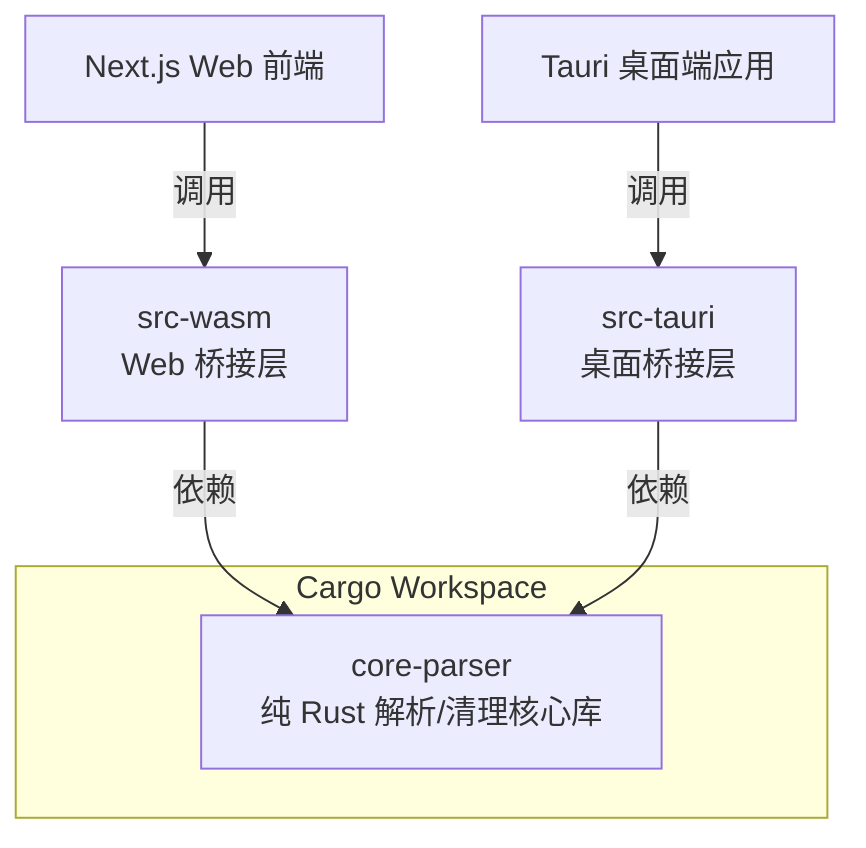

# 14. 基于 metadocu.com 当前 UI 的隐私审计器布局设计方案

## 14.1 设计目标

当前网站已经具备一个轻量工具站的基础形态：

```text
Hero 主视觉
核心卖点标签
主 CTA
上传卡片
支持格式说明
功能介绍内容
FAQ
Quick Links
```

因此，本次升级不建议重做整站 UI，而是基于现有结构做增强：

```text
从 Office Metadata Editor
升级为 Private Metadata Scanner / Metadata Privacy Auditor
```

核心设计目标：

```text
1. 保留当前简洁、直接、工具站风格。
2. 把“本地处理、不上传服务器”放到更显眼位置。
3. 把“编辑 metadata”升级为“扫描隐私风险”。
4. 让用户在上传前就知道：这个工具安全、私密、可信。
5. 让 SEO 内容和上传工具强绑定，而不是内容和工具割裂。
```

---

## 14.2 当前 UI 不建议大改的部分

当前网站已经有几个适合保留的结构：

```text
Ready in a second
100% Local
Drag & Drop
Batch Boost
Open Batch Workspace
Start Editing
Drag & Drop to Upload
Supported File Types
FAQ
Quick Links
```

这些结构对工具站是有价值的，建议保留，但文案和信息层级需要升级。

---

# 15. 首页整体布局设计

建议首页结构调整为：

```text
Header
  ↓
Hero Section
  ↓
Trust Bar 本地隐私信任条
  ↓
Upload Scanner Card 上传扫描卡片
  ↓
Risk Preview Section 风险能力预览
  ↓
How It Works 工作流程
  ↓
Privacy by Design 本地处理说明
  ↓
Supported File Types 支持格式
  ↓
SEO Content Section 长内容承接
  ↓
FAQ
  ↓
Quick Links
  ↓
Footer
```

这个结构的重点是：

```text
上传组件前：增强信任
上传组件中：突出扫描风险
上传组件后：解释风险和 SEO 承接
```

---

# 16. Header 顶部设计

## 16.1 当前状态

当前 Header 比较简单，主要是品牌名和语言切换。

## 16.2 建议调整

品牌名建议从：

```text
office-metadata-editor
```

调整为：

```text
MetaDocu
```

或者：

```text
MetaDocu Privacy Scanner
```

导航建议增加：

```text
Metadata Scanner
Batch Cleaner
PDF Metadata
Word Metadata
EXIF Cleaner
FAQ
```

右侧保留语言切换：

```text
中 / EN
```

---

## 16.3 Header 示例布局

```text
MetaDocu

Metadata Scanner | Batch Cleaner | PDF Metadata | Word Metadata | EXIF Cleaner | FAQ

中
```

---

## 16.4 Header 设计约束

```text
1. 不要做复杂导航。
2. 不要使用太多颜色。
3. 保持当前轻量工具站风格。
4. 当前页面核心任务是上传扫描，不要让导航抢主 CTA。
```

---

# 17. Hero Section 设计

## 17.1 当前问题

当前 Hero 主要表达：

```text
Office Metadata Editor
Read, edit, clean, and batch process all locally.
```

这个表达偏“功能工具”，但隐私审计感不够强。

## 17.2 建议升级后的 Hero

### 顶部小标签

保留当前 `Ready in a second` 的感觉，但换成更强的信任表达：

```text
Ready in a second · No upload required
```

或者：

```text
Private by design · Runs locally in your browser
```

---

### H1

建议从：

```text
Office Metadata Editor
```

升级为：

```text
Free Private Metadata Scanner
```

或者更偏审计：

```text
Metadata Privacy Auditor
```

推荐最终用：

```text
Free Private Metadata Scanner
```

原因：

```text
1. SEO 更直接。
2. 用户更容易理解。
3. Private 和 Scanner 都是高意图词。
4. 比 Auditor 更适合普通用户。
```

---

### Subtitle

```text
Check hidden metadata privacy risks in PDF, Word, Excel, and image files before sharing them online. Everything runs locally in your browser — your files are never uploaded to our server.
```

中文理解：

```text
在分享 PDF、Word、Excel 和图片之前，检查隐藏的 metadata 隐私风险。
所有处理都在浏览器本地完成，文件不会上传到服务器。
```

---

## 17.3 Hero 卖点标签

当前是：

```text
100% Local
Drag & Drop
Batch Boost
```

建议升级为：

```text
100% Local
No Upload
Privacy Risk Scan
Batch Clean
```

如果保持 3 个标签：

```text
100% Local
No Upload
Risk Scanner
```

如果支持 4 个标签：

```text
100% Local
No Upload
Risk Report
Batch Clean
```

---

## 17.4 Hero CTA

当前 CTA：

```text
Open Batch Workspace
Start Editing
```

建议调整为：

```text
Scan Metadata Risks
Open Batch Workspace
```

主次关系：

```text
主按钮：Scan Metadata Risks
次按钮：Open Batch Workspace
```

不要再把 `Start Editing` 作为主 CTA，因为当前产品要先卖“隐私风险发现”，再卖“编辑/清理”。

---

## 17.5 Hero 最终示例

```text
Private by design · Runs locally in your browser

Free Private Metadata Scanner

Check hidden metadata privacy risks in PDF, Word, Excel, and image files before sharing them online.
Everything runs locally in your browser — your files are never uploaded to our server.

[100% Local] [No Upload] [Risk Scanner] [Batch Clean]

[Scan Metadata Risks] [Open Batch Workspace]
```

---

# 18. Trust Bar 本地隐私信任条

## 18.1 放置位置

建议放在 Hero 和上传卡片之间。

原因：

```text
用户点击上传前，最关心的是：我的文件会不会被上传？
```

因此需要在上传前明确回答这个问题。

---

## 18.2 设计形态

可以做成横向浅色信息条。

```text
Your files never leave your device. Metadata scanning runs locally in your browser.
```

下方配 3 个短点：

```text
No file upload
No server-side storage
No access to document content
```

---

## 18.3 UI 示例

```text
┌─────────────────────────────────────────────────────────────┐
│ 🔒 Your files never leave your device.                      │
│ Metadata scanning runs locally in your browser.             │
│                                                             │
│ No file upload   No server storage   No content access      │
└─────────────────────────────────────────────────────────────┘
```

---

## 18.4 设计建议

```text
背景：浅灰 / 极浅绿色 / 极浅蓝
边框：低饱和细边框
图标：锁 / 盾牌 / 浏览器
文字：简短直接
```

不要使用强烈红色，因为当前网站气质更适合干净、中性、可信赖的视觉。

---

# 19. Upload Scanner Card 上传扫描卡片

## 19.1 当前上传区

当前上传区大概是：

```text
Drag & Drop to Upload
Edit single files or batch process multiple files from here
Click or drag files here
Supports .docx / .doc / .xlsx / .pdf, multiple files allowed
```

这个结构可以保留，但需要改成“扫描优先”。

---

## 19.2 上传卡片标题

建议从：

```text
Drag & Drop to Upload
```

调整为：

```text
Scan Metadata Privacy Risks
```

副标题：

```text
Drag and drop your file here to check hidden metadata risks locally in your browser.
```

---

## 19.3 上传区域文案

```text
Click or drag files here to scan metadata risks
```

支持格式：

```text
Supports .pdf / .docx / .xlsx / .pptx / .jpg / .png
```

隐私提示：

```text
No upload required. Your file is processed locally.
```

---

## 19.4 上传卡片内部模式切换

建议在上传卡片顶部增加一个轻量 tab：

```text
Scan Risks | Edit Metadata | Batch Clean
```

默认选中：

```text
Scan Risks
```

原因：

```text
1. 不丢失原来的编辑器能力。
2. 但默认用户路径变成隐私扫描。
3. 后续可以根据不同 SEO 页面默认切换 tab。
```

---

## 19.5 上传卡片 UI 示例

```text
┌─────────────────────────────────────────────────────────────┐
│ Scan Risks   Edit Metadata   Batch Clean                    │
│                                                             │
│ Scan Metadata Privacy Risks                                 │
│ Drag and drop your file here to check hidden metadata risks. │
│                                                             │
│ ┌─────────────────────────────────────────────────────────┐ │
│ │                                                         │ │
│ │        Drag & drop files here                           │ │
│ │        or click to choose files                         │ │
│ │                                                         │ │
│ │        Supports PDF, DOCX, XLSX, PPTX, JPG, PNG          │ │
│ │                                                         │ │
│ └─────────────────────────────────────────────────────────┘ │
│                                                             │
│ 🔒 No upload required. Processed locally in your browser.    │
└─────────────────────────────────────────────────────────────┘
```

---

## 19.6 上传后的扫描中状态

扫描中不要显示“Uploading”，因为这会和“不上传服务器”冲突。

禁止文案：

```text
Uploading file...
```

推荐文案：

```text
Scanning locally...
```

或者：

```text
Reading metadata in your browser...
```

扫描进度步骤：

```text
Reading file locally
Extracting metadata
Checking privacy risks
Generating audit report
```

UI 示例：

```text
Scanning locally...

[x] Reading file locally
[x] Extracting metadata
[ ] Checking privacy risks
[ ] Generating audit report
```

---

# 20. 扫描结果页布局

## 20.1 结果页整体结构

上传扫描完成后，建议直接在同页展示结果，不要跳转。

结构：

```text
Result Summary Card
  ↓
Privacy Confirmation Bar
  ↓
Risk Categories
  ↓
Risk Detail Cards
  ↓
Clean Metadata CTA
  ↓
Raw Metadata Table
  ↓
Rescan Confirmation
```

---

## 20.2 Result Summary Card

顶部结果卡应该非常明确。

```text
Metadata Privacy Audit Report

Risk Level: High

7 metadata risks found
3 privacy-sensitive fields detected
```

增加文件信息：

```text
File type: DOCX
Scanned locally in: 1.2s
File upload: No
```

---

## 20.3 结果卡 UI 示例

```text
┌─────────────────────────────────────────────────────────────┐
│ Metadata Privacy Audit Report                              │
│                                                             │
│ Risk Level: High                                            │
│                                                             │
│ 7 metadata risks found                                      │
│ 3 privacy-sensitive fields detected                         │
│                                                             │
│ File type: DOCX                                             │
│ Scanned locally in: 1.2s                                    │
│ File upload: No                                             │
│                                                             │
│ [Remove Metadata Locally] [Download Audit Report]           │
└─────────────────────────────────────────────────────────────┘
```

---

## 20.4 Privacy Confirmation Bar

结果页也要再次强调：

```text
This audit was generated locally in your browser. Your file was not uploaded.
```

原因：

```text
用户看到扫描结果后，可能会再次担心：这些字段是不是已经传给服务器了？
```

所以结果页必须重复强调本地处理。

---

## 20.5 风险分类模块

不要直接展示一堆字段，先按风险类型分组。

```text
Identity Exposure
Organization Exposure
Timeline Exposure
Local Environment Exposure
Collaboration History
Software Fingerprint
Embedded Media Exposure
```

UI 示例：

```text
┌──────────────────────┐ ┌──────────────────────┐ ┌──────────────────────┐
│ Identity Exposure    │ │ Organization Exposure│ │ Local Path Exposure  │
│ 2 risks              │ │ 1 risk               │ │ 1 high risk          │
└──────────────────────┘ └──────────────────────┘ └──────────────────────┘
```

---

## 20.6 风险详情卡片

每个风险项用卡片展示。

示例：

```text
[High] Local template path exposed

Detected field:
Template Path

Value:
C:\Users\jack\Documents\ClientA\contract-template.dotx

Why this matters:
This may reveal your username, folder structure, project name, or client information.

Recommended action:
Remove template path metadata before sharing this document.

Status:
Can be removed automatically
```

---

## 20.7 敏感值展示约束

敏感值不要默认全部明文展示，可以做脱敏 + 展开。

默认展示：

```text
C:\Users\j***\Documents\C***\contract-template.dotx
```

旁边按钮：

```text
Show full value
```

并增加提示：

```text
This value is only displayed locally in your browser.
```

这样既保护隐私，又增强信任感。

---

## 20.8 Clean Metadata CTA

结果页最重要的转化按钮：

```text
Remove Metadata Locally
```

副文案：

```text
Clean detected metadata risks in your browser. No upload required.
```

按钮组：

```text
Remove Metadata Locally
Download Audit Report
Scan Another File
```

---

# 21. Risk Preview Section 风险能力预览

## 21.1 放置位置

放在上传卡片下面。

作用：

```text
让还没上传的用户知道工具能检测什么。
```

---

## 21.2 模块标题

```text
What privacy risks can metadata reveal?
```

副标题：

```text
Documents and images may contain hidden metadata that exposes identity, company information, local paths, timestamps, comments, software origin, or GPS data.
```

---

## 21.3 风险能力卡片

建议做 6 个卡片：

```text
Author Name
Company Info
Local File Path
Comments & Revisions
PDF Creator / Producer
Image EXIF & GPS
```

---

## 21.4 UI 示例

```text
What privacy risks can metadata reveal?

┌──────────────────────┐ ┌──────────────────────┐ ┌──────────────────────┐
│ Author Name          │ │ Company Info         │ │ Local File Path      │
│ Reveals creator      │ │ Reveals organization │ │ Reveals username     │
└──────────────────────┘ └──────────────────────┘ └──────────────────────┘

┌──────────────────────┐ ┌──────────────────────┐ ┌──────────────────────┐
│ Comments & Revisions │ │ PDF Creator          │ │ Image EXIF & GPS     │
│ Reveals edit history │ │ Reveals software     │ │ Reveals location     │
└──────────────────────┘ └──────────────────────┘ └──────────────────────┘
```

---

# 22. How It Works 模块

## 22.1 目的

解释整个流程，降低用户理解成本。

---

## 22.2 文案

```text
How it works
```

步骤：

```text
1. Choose a file
Select a PDF, Word, Excel, PowerPoint, or image file.

2. Scan locally
The file is read in your browser. It is not uploaded to our server.

3. Review privacy risks
See exposed author names, company names, local paths, timestamps, comments, and EXIF data.

4. Clean and rescan
Remove metadata locally and scan again to confirm the risks are gone.
```

---

## 22.3 UI 示例

```text
Choose File → Scan Locally → Review Risks → Clean & Rescan
```

这个模块适合放在风险能力卡片之后。

---

# 23. Privacy by Design 模块

## 23.1 目的

这是 SEO 和转化都很重要的模块。

要明确区分你和普通上传型工具：

```text
Most online metadata tools require file upload.
MetaDocu processes files locally.
```

---

## 23.2 模块标题

```text
Private by Design
```

---

## 23.3 模块文案

```text
Most online metadata tools require you to upload files to a remote server. This can be risky when working with contracts, resumes, legal documents, financial files, or internal business documents.

MetaDocu scans metadata locally in your browser. Your files stay on your device and are never uploaded to our server.
```

---

## 23.4 三个信任点

```text
No file upload
No server-side storage
No access to document content
```

---

## 23.5 UI 示例

```text
┌─────────────────────────────────────────────────────────────┐
│ Private by Design                                           │
│                                                             │
│ Most online metadata tools require you to upload files...   │
│ MetaDocu scans metadata locally in your browser...          │
│                                                             │
│ [No file upload] [No server-side storage] [No content access]│
└─────────────────────────────────────────────────────────────┘
```

---

# 24. Supported File Types 模块

## 24.1 当前问题

当前支持格式区域比较简单，只展示：

```text
.docx .doc .xlsx .pdf
```

建议升级为格式卡片，同时说明每种格式能检测什么。

---

## 24.2 推荐格式卡片

```text
PDF
Author, Creator, Producer, timestamps, XMP metadata

Word DOCX
Author, Company, Last Modified By, comments, template path

Excel XLSX
Author, Company, workbook properties, custom metadata

PowerPoint PPTX
Author, comments, media metadata, presentation properties

Images
EXIF, GPS, camera model, software, capture time
```

---

## 24.3 UI 示例

```text
Supported File Types

┌──────────┐ ┌──────────┐ ┌──────────┐
│ PDF      │ │ DOCX     │ │ XLSX     │
│ Metadata │ │ Comments │ │ Workbook │
└──────────┘ └──────────┘ └──────────┘

┌──────────┐ ┌──────────┐
│ PPTX     │ │ Images   │
│ Slides   │ │ EXIF/GPS │
└──────────┘ └──────────┘
```

---

# 25. SEO Content Section 长内容承接

## 25.1 当前内容问题

当前页面已有 `One-Stop Office Document Metadata Processing`，但内容还是偏“编辑 metadata”。

建议升级为：

```text
One-Stop Metadata Privacy Scanner
```

或者：

```text
Check and Remove Hidden Metadata Privacy Risks
```

---

## 25.2 推荐内容结构

```text
H2: One-Stop Metadata Privacy Scanner

Intro:
MetaDocu helps you find hidden metadata risks before sharing files online. It can detect author names, company information, timestamps, local template paths, PDF creator data, comments, revision history, and embedded image EXIF data.

H3: Word Document Privacy Risks
Explain author, company, last modified by, comments, revisions, template path.

H3: PDF Metadata Privacy Risks
Explain author, creator, producer, creation date, modification date, XMP metadata.

H3: Image EXIF Privacy Risks
Explain GPS, camera model, software, capture time, embedded images.

H3: Local Browser Processing
Explain no upload, no server storage, local processing.

H3: Batch Metadata Cleaning
Explain batch workspace and enterprise/team use cases.
```

---

## 25.3 这一块的作用

```text
1. 承接 SEO 长尾词。
2. 解释 metadata 风险。
3. 给工具上传区提供上下文。
4. 增强页面内容厚度。
5. 保留当前内容型工具站结构。
```

---

# 26. FAQ 模块设计

## 26.1 当前 FAQ 可以保留，但要改成隐私审计导向

建议 FAQ 顺序调整为：

```text
1. Are my files uploaded to your server?
2. What metadata privacy risks can this tool detect?
3. How do I check PDF metadata without uploading?
4. How do I remove author metadata from a Word document?
5. Can Word documents reveal comments or revision history?
6. Can images contain GPS metadata?
7. Can I batch clean metadata from multiple files?
8. Is local metadata scanning safer?
```

---

## 26.2 FAQ 示例

### Are my files uploaded to your server?

```text
No. Metadata scanning runs locally in your browser. Your files are not uploaded, stored, or sent to our server.
```

### What metadata privacy risks can this tool detect?

```text
MetaDocu can detect common metadata risks such as author names, company names, last modified by, creation time, modification time, local template paths, PDF creator and producer fields, comments, revision history, and image EXIF data.
```

### Can Word documents reveal comments or revision history?

```text
Yes. Word documents may contain comments, tracked changes, revision history, editor names, and timestamps. These can reveal internal discussion or deleted content if not reviewed before sharing.
```

### Can images contain GPS metadata?

```text
Yes. Photos may contain EXIF metadata such as GPS coordinates, camera model, capture time, software, and device information.
```

---

# 27. Quick Links 设计

## 27.1 当前 Quick Links 可以继续保留

但链接方向建议从“编辑属性”扩展到“隐私风险 + no upload”。

---

## 27.2 推荐 Quick Links

```text
Check PDF Metadata Without Uploading
Remove PDF Metadata
Check Word Document Metadata
Remove Author Metadata from Word
Remove EXIF Data Without Uploading
Private Metadata Scanner
Document Privacy Checker
Batch Clean Metadata
```

---

## 27.3 URL 建议

```text
/pdf-metadata-scanner-no-upload
/remove-pdf-metadata
/check-word-document-metadata
/remove-author-metadata-from-word
/remove-exif-without-upload
/private-metadata-scanner
/document-privacy-checker
/batch-metadata-cleaner
```

---

# 28. 视觉风格建议

## 28.1 保持当前风格

当前网站偏：

```text
简洁
干净
工具站
轻量
直接
```

不要突然改成复杂的安全 SaaS 风格。

---

## 28.2 推荐视觉关键词

```text
Clean
Private
Local
Fast
Trustworthy
Minimal
```

---

## 28.3 颜色建议

推荐：

```text
主色：低饱和蓝 / 靛蓝 / 中性黑
辅助色：浅绿色用于 local / safe
警示色：琥珀色用于 medium risk
高风险：不要大面积红色，只在小标签上使用柔和红
背景：白色 / 极浅灰
卡片：白底 + 细边框 + 轻阴影
```

风险等级颜色：

```text
Low: muted green
Medium: amber
High: muted red
```

注意：

```text
High risk 不要整块大红，避免让页面廉价和刺眼。
```

---

# 29. 首屏最终布局示例

```text
Header:
MetaDocu    Metadata Scanner | Batch Cleaner | PDF Metadata | Word Metadata | EXIF Cleaner | FAQ    中

Hero:
Private by design · Runs locally in your browser

Free Private Metadata Scanner

Check hidden metadata privacy risks in PDF, Word, Excel, and image files before sharing them online.
Everything runs locally in your browser — your files are never uploaded to our server.

[100% Local] [No Upload] [Risk Scanner] [Batch Clean]

[Scan Metadata Risks] [Open Batch Workspace]

Trust Bar:
Your files never leave your device.
No file upload · No server-side storage · No access to document content

Upload Card:
[Scan Risks] [Edit Metadata] [Batch Clean]

Scan Metadata Privacy Risks
Drag and drop your file here to check hidden metadata risks locally in your browser.

Click or drag files her---

## 35.7 Next.js "use client" 组件与动态水合规范

由于 WebAssembly APIs 以及 `init()` 初始化仅能在浏览器环境（Client-side）中运行，为避免 Next.js 服务端预渲染（SSR）阶段发生 `WebAssembly is not defined` 或水合不一致的崩溃，需遵循以下开发规范：

```text
1. 客户端组件声明
所有导入和直接消费 Wasm 模块的前端组件，必须在文件第一行声明 "use client";，将其明确标记为客户端组件。

2. 动态异步水合与初始化
禁止在文件顶部模块级同步 `await init()`。必须通过 React 的 `useEffect` 机制进行异步懒加载，或利用 Next.js 的 `next/dynamic`（配置 `ssr: false`）对 Wasm 桥接组件进行懒加载。
```

前端懒加载 Hook 示范：
```typescript
import { useEffect, useState } from "react";

export function useWasmParser() {
  const [wasmInstance, setWasmInstance] = useState<any>(null);
  const [loading, setLoading] = useState(true);

  useEffect(() => {
    async function initWasm() {
      try {
        const wasm = await import("@/lib/wasm/office_metadata_parser_wasm");
        await wasm.default(); // 异步初始化实例
        setWasmInstance(wasm);
      } catch (err) {
        console.error("Failed to load Wasm parser:", err);
      } finally {
        setLoading(false);
      }
    }
    initWasm();
  }, []);

  return { parser: wasmInstance, loading };
}
```
通过这种异步水合设计，在 Wasm 初始化未就绪时，前端可渲染安全的 “本地沙箱环境初始化中...” 骨架屏，这既能根治 SSR 报错，又在用户心理上增强了对“100% 本地浏览器沙箱运行”的安全感与专业可信赖度。

---

## 35.8 Wasm 侧的高性能裸指针内存交互与一键清理方案

针对核心功能“一键本地清理元数据 (Remove Metadata Locally)”，**严禁在前端使用第三方 JS 库（如 JSZip, pdf-lib）来执行回写修改**，避免因为两端修改算法存在微小不一致而破坏数据完整性。

整个回写与清理机制必须 **完全在 Wasm 侧由底层 Rust 直接处理**，为了追求极致性能并彻底根除内存泄露，**必须采用裸指针零拷贝与主动 Layout 释放模式**：

```text
1. 导出裸指针与容量元组
Wasm 侧的 Rust 清理函数不直接返回 `Result<Vec<u8>>`，因为 wasm-bindgen 默认的自动 Vec 传输会引发不必要的隐式复制和生命周期释放冲突。
【高性能解法】：Rust 侧返回一个自定义的 Wasm 字节结构体或裸指针元组，明确包含：字节裸指针 `ptr: *mut u8`、数据当前长度 `len: usize` 以及内存块物理容量 `cap: usize`。

2. JS 侧极速深拷贝与立即释放
JS 侧接收到指针后，立即通过 Wasm Memory 建立临时 TypedArray 视图，并通过 `new Uint8Array(rawView)` 同步执行深拷贝，将数据转移至 JavaScript 堆。
深拷贝完成后，JS 侧必须立即同步调用 Rust 导出的 `deallocate_wasm_memory(ptr, cap)`。

3. Rust 侧 Layout 精准释放
Rust 侧接收到 `ptr` 和 `cap` 后，使用与分配时完全相同的容量重建 `Layout`（Layout::from_size_align_unchecked(cap, 1)），调用 `dealloc(ptr, layout)` 归还线性内存。这样能使分配器（如 dlmalloc）立刻复用空间，达到极致的内存利用率。
```

Wasm 侧 Rust 高性能清理与内存回收接口伪代码：
```rust
use std::alloc::{alloc, dealloc, Layout};
use wasm_bindgen::prelude::*;

#[wasm_bindgen]
pub struct WasmBuffer {
    ptr: *mut u8,
    len: usize,
    cap: usize,
}

#[wasm_bindgen]
impl WasmBuffer {
    #[wasm_bindgen(getter)]
    pub fn ptr(&self) -> *mut u8 { self.ptr }
    #[wasm_bindgen(getter)]
    pub fn len(&self) -> usize { self.len }
    #[wasm_bindgen(getter)]
    pub fn cap(&self) -> usize { self.cap }
}

#[wasm_bindgen]
pub fn clean_docx_wasm(file_bytes: &[u8]) -> Result<WasmBuffer, JsValue> {
    let mut cleaned_bytes = Vec::new();
    core_parser::docx::strip_metadata(file_bytes, &mut cleaned_bytes)
        .map_err(|err| JsValue::from_str(&err.to_string()))?;
        
    let cap = cleaned_bytes.capacity();
    let len = cleaned_bytes.len();
    
    // 抑制 Rust 自动释放 Vec，将其生命周期转移给裸指针
    let mut boxed_slice = cleaned_bytes.into_boxed_slice();
    let ptr = boxed_slice.as_mut_ptr();
    std::mem::forget(boxed_slice);
    
    Ok(WasmBuffer { ptr, len, cap })
}

// 导出精准的 dealloc 函数供 JS 端立即同步调用
#[wasm_bindgen]
pub fn deallocate_wasm_memory(ptr: *mut u8, cap: usize) {
    unsafe {
        // Wasm 中对齐通常为 1 字节
        let layout = Layout::from_size_align_unchecked(cap, 1);
        dealloc(ptr, layout);
    }
}
```

前端极速消费与即时回收 JavaScript 闭环示例：
```typescript
// 1. 调用 Wasm 清理接口拿到裸指针结构体
const wasmBuffer = wasm_instance.clean_docx_wasm(originalBytes);
const ptr = wasmBuffer.ptr;
const len = wasmBuffer.len;
const cap = wasmBuffer.cap;

try {
  // 2. 建立极速临时视图（零拷贝读取 Wasm 线性内存）
  const rawView = new Uint8Array(wasm_instance.memory.buffer, ptr, len);

  // 3. 极速深拷贝数据到 JavaScript 堆中
  const safeJSBytes = new Uint8Array(rawView);

  // 4. 使用 safeJSBytes 转换为 Blob 用于前台下载
  const blob = new Blob([safeJSBytes], { type: "application/vnd.openxmlformats-officedocument" });
} finally {
  // 5. 无论如何，立即同步调用 Wasm 侧释放，消除 OOM 隐患
  wasm_instance.deallocate_wasm_memory(ptr, cap);
}
```

---

## 35.9 大文件 OOM 限制与客户端引流预留设计

考虑到 MVP（最简可行产品）版本的轻量性，**当前阶段暂不针对大文件引入复杂的 Web 侧流式分块处理（防止增加架构复杂度），但必须在架构和 UI 交互上预留该内存溢出（OOM）的防护墙与引流口**：

```text
1. 前端上传尺寸强限额
在网页版前端上传阶段设置合理的硬性拦截上限（例如限制单文件处理最大为 30MB-50MB）。

2. 优雅防 OOM 降级提示
当用户上传文件超过限制时，UI 不抛错、不崩溃，而是展示温馨的本地降级引导，并借此为未来的桌面端做天然的下载引流。
```

网页端限额与引流 UI 提示文案预留：
> 💡 **出于浏览器本地内存安全考虑，网页端最大支持处理 30MB 的文件。**
> 如果您需要扫描或一键清理超大文档/多图幻灯片，请 [下载 MetaDocu 免费桌面客户端](#)（支持 Windows / macOS，处理速度更快，无大小限制）。

在用户完成大文件解析后，前端在下载完成后必须执行变量置空（`null`）并立即调用 `URL.revokeObjectURL(downloadUrl)`，协助浏览器 V8 引擎快速释放内存空间。

---

## 35.10 PDF 边界漏洞（数字签名与密码保护）的闭环解决方案与防损坏救砖机制

针对 PDF 格式特希有“数字签名（Digital Signatures）破坏”以及“密码保护（Password Encrypted）无法解析”的底层边缘漏洞，设计以下完备的闭环与降级救砖解决方案：

### 35.10.1 数字签名检测与用户抉择（Digital Signatures Warning）
* **原理**：如果 PDF 包含官方数字签名，任何对其 Metadata 的重写或清理，都会直接破坏 PDF 文件哈希一致性，导致签名失效。
* **解决方案**：
  1. 在 Wasm 侧解析 PDF 时，Rust 代码优先检测文档中是否存在 `/Sig` 或 `/Signatures` 字段。
  2. 若检测到签名，UI 侧将弹窗显示 **黄色警示（Warning）** 并交由用户抉择，确保用户拥有 100% 的知情权和决定权。

### 35.10.2 密码加密捕获与本地解密引导（Password Protection Decryption）
* **原理**：已加密的 PDF 文件在没有输入密码前，直接调用 `lopdf::Document::load_mem` 会抛出 `Err(Encrypted)` 异常，导致前端解析直接失败。
* **解决方案**：
  1. 捕获该解密失败异常，优雅拦截崩溃。
  2. UI 侧优雅降级，向用户弹出 **本地密码输入框**。在 Wasm 中传入该密码重新解密解析。若解密失败或用户拒绝输入，则友好提示“无法扫描加密文档”。

### 35.10.3 关键：PDF 物理完全重建的防损坏与“双轨救砖机制”
* **隐患**：为了彻底清除历史增量更新中的元数据残留，采用 `lopdf` 的 `cross_reference_table` 完全物理重建模式，这在极少数包含畸形非标准对象的 PDF 中，可能会因为重建偏移失败导致页面元素损坏或白屏。
* **物理防损坏与自动回滚（Safe Fallback）闭环策略**：
  为确保用户文档 **100% 不损坏、可打开**，Rust 与前端建立以下双轨救砖流水线：
  ```text
  [ 物理完全重建 ] ──> [ Wasm 内存中静默预解析校验 ]
                              │
                              ├──> [校验成功] ──> 返回物理完全重建的 100% 干净字节
                              │
                              └──> [校验失败/抛错] ──> 自动回滚 ──> [ 保守占位擦除（无物理偏移变化） ] ──> 返回安全文件
  ```
  1. **Wasm 端内存静默预解析自检**：在 Rust 侧执行完全重建保存后，不急于返回前端，而是在内存中立即使用 `lopdf::Document::load_mem(&reconstructed_bytes)` 重新加载一次。若抛出解析异常，说明重建过程损坏了 PDF 物理结构。
  2. **自动回滚至保守模式（Fallback to Safe Mode）**：一旦预解析自检失败，Wasm 立即放弃物理重建字节，**自动降级并回滚（Fallback）** 为使用只擦除 /Info 字典属性、保持对象结构原封不动的“保守占位保存字节”。这虽然保留了增量历史，但能 **100% 保证文件不损坏**。
  3. **前端“双向双下载”救砖后备通道**：前端 UI 默认下载清理后的文件。同时在界面底部提供小字备用链接：“若您下载后发现文档在某些旧版阅读器中排版异常，请 [下载保守安全备份版](#)（采用保留结构的兼容模式清理）或 [下载原始未清理备份](#)”。这彻底闭环了损坏风险。

---

## 35.11 合规与用户隐私条款授权规范

针对产品 “100% Local · No Upload” 的核心隐私卖点，确立严格的合规性与用户授权授权规范：

```text
1. 零隐性上报原则
当前项目不引入 Sentry 错误日志收集。若未来在上线版本中为提高稳定性需要引入异常监控或基础的匿名流量统计，必须在用户上传前和页脚明确展示《隐私条款与数据授权协议》。

2. 错误模糊化与明示授权
未来若因 Wasm 解析失败上报错误日志，必须在前端截获该报错，并强制剥离所有可能涉及用户隐私的信息（如绝对路径、真实文件名等，替换为 [REDACTED]）。同时需向用户弹窗：“我们检测到文件本地解析失败，是否同意将不含任何文档内容的匿名脱敏报错报告发送给我们以帮助改进？”在获得用户明示点击“授权同意”后，方可发生网络上报，捍卫核心隐私口碑。
```

---

## 35.12 未来双端（Web & 桌面）演进与 Cargo Workspace 共享规划

为了协调“当前以 Web 端开发为主，未来才考虑桌面端”的演进路线，并彻底解决潜在的维护分叉债务，制定以下演进规划：

```text
1. 第一阶段（当前 MVP）：聚焦 Web 端开发
所有的元数据解析、脱敏与一键回写清理 Rust 算法，统一在独立的 `src-wasm` Crate 内进行高内聚的编写和测试，以最快速度支撑 Web 端产品上线与交付。

2. 第二阶段（未来规划）：双端移植与 Cargo Workspace 提取
当后续版本决定引入 Tauri 桌面客户端时，通过一行命令将 `src-wasm` 中沉淀出的平台无关的纯 Rust 底层解析/回写核心逻辑，剥离并移植至 Workspace 共享目录 `core-parser` 纯 Rust 库。
```

未来双端共享依赖架构图：


通过这一演进规划，MVP 阶段我们能够**100% 聚焦于 Web 端 Wasm 的极速交付**；而在未来拓展桌面端时，通过 Cargo Workspace 自动实现底层算法的“一套代码、双端复用”，完美消除“两端逻辑不一致”的技术分裂隐患。

---

## 35.13 批量处理（Batch Clean）下的 Web Worker 异步计算通道规范

当用户同时拖入多个大文件执行批量扫描与一键清理（Batch Clean）时，由于 Wasm 的解压缩、XMLTree 树重构以及 PDF 重建均属于 CPU 密集型计算任务，**直接在主线程（Main Thread）中执行会导致浏览器界面假死、进度动画卡顿甚至抛出“页面无响应”崩溃警告**。

为保障绝对流畅的并发体验，建立以下 Web Worker 异步通道开发规范：

```text
1. 异步计算分离
禁止在主线程中执行 `parse_xxx_wasm` 与 `clean_xxx_wasm` 的核心计算逻辑，必须将其解耦至独立的 Web Worker 线程中。

2. 惰性单例 Worker 实例
前端建立惰性单例 Web Worker 通道，在页面挂载时初始化一次，多文件批量任务通过并发或队列形式异步投递至 Worker，由主线程监听 postMessage 返回状态。

3. 红线警示：严禁直接 Transfer Wasm 线性内存 Buffer
【致命崩溃防范】：在 postMessage 的 Transferable 列表参数中，严禁直接传入指向 `wasm_instance.memory.buffer` 物理范围内的 Buffer 视图。这会导致 Wasm 模块物理内存被浏览器彻底强行“切断剥离（Detach）”，导致整个 Wasm 实例当场瘫痪。必须使用在 JavaScript 堆中**深拷贝**出来的独立 `ArrayBuffer`（如上述 safeJSBytes.buffer）来进行 Transfer 所有权转移。
```

Web Worker 脚本架构设计示范 (`@/lib/workers/wasm-worker.ts`)：
```typescript
import initWasm, { parse_docx_wasm, clean_docx_wasm, deallocate_wasm_memory } from "@/lib/wasm/office_metadata_parser_wasm";

let isWasmInitialized = false;

self.onmessage = async (e: MessageEvent) => {
  const { type, fileBytes, fileName } = e.data;

  // 保证 Wasm 模块仅在 Worker 线程内初始化一次
  if (!isWasmInitialized) {
    await initWasm();
    isWasmInitialized = true;
  }

  try {
    if (type === "PARSE") {
      const metadata = parse_docx_wasm(fileBytes, fileName);
      self.postMessage({ success: true, type: "PARSE_SUCCESS", data: metadata, fileName });
    } else if (type === "CLEAN") {
      // 1. 调用 Wasm 高性能清理函数，返回包含裸指针和容量的 WasmBuffer 结构
      const wasmBuffer = clean_docx_wasm(fileBytes);
      const ptr = wasmBuffer.ptr;
      const len = wasmBuffer.len;
      const cap = wasmBuffer.cap;
      
      try {
        // 2. 建立临时内存视图
        const rawView = new Uint8Array(self.wasm_instance.memory.buffer, ptr, len);
        // 3. 深拷贝到 JS 堆，脱离 Wasm 线性内存引用关系
        const safeJSBytes = new Uint8Array(rawView);
        
        // 4. 使用 Transferable 零拷贝技术转移 JS 堆上的独立 ArrayBuffer，极速响应且绝不损坏 Wasm
        self.postMessage(
          { success: true, type: "CLEAN_SUCCESS", data: safeJSBytes, fileName },
          [safeJSBytes.buffer]
        );
      } finally {
        // 5. 无论如何，立即同步释放 Rust 侧堆内存，杜绝堆积 OOM
        deallocate_wasm_memory(ptr, cap);
      }
    }
  } catch (err: any) {
    self.postMessage({ success: false, error: err.toString(), fileName });
  }
};
```

---

## 35.14 Wasm 线性内存与 Transferable 零拷贝释放机制

由于 Wasm 线性内存空间（Memory Page）在浏览器中单向增长且不会自动缩容，在批量处理大文件时极易发生内存持续堆积，最终导致浏览器标签页 OOM。因此，必须在前端和 Wasm 桥接层建立严格的内存释放与防泄露机制：

```text
1. 零拷贝所有权转移（Transferable Objects）
前端在将 `Uint8Array` 数据通过 postMessage 发送给 Web Worker 或接收返回的清理文件时，必须将其 Buffer 放入 Transferable 数组中。这会使发送方瞬间失去对该内存块的引用，零成本实现数据所有权转移，防止内存副本双重残留。

2. 显式撤销 Blob URL 引用
生成 Blob 触发本地无网络下载后，必须在 30 秒内或下载成功回调中立即调用 `URL.revokeObjectURL(downloadUrl)`，解除 DOM 引用绑定，确保 V8 引擎能快速执行垃圾回收（GC）。
```

---

## 35.15 Office 关系树一致性重构与多媒体（Media/EXIF）深度净化与损坏自检补救

在 Rust 核心层 `core-parser` 针对 Office（ZIP）剥离元数据时，必须进行“深度无损清理”，绝不能采取简单的暴力物理删除：

```text
1. 关系树一致性维护（Relation Tree Consistency）与 app.xml 全量覆盖
禁止直接从归档中硬删除 `docProps/core.xml` 或 `docProps/custom.xml` 等文件。
【全量覆盖重构】：必须采取组群全覆盖策略。必须同时针对 `docProps/core.xml`、`docProps/app.xml`（记录了软件版本、文档模板物理路径等重大敏感信息）和可能存在的 `docProps/custom.xml` 进行空白合法的 XML 覆盖写。
重构必须保留其 XML 基础命名空间（XML Namespace）等格式根节点声明，但彻底擦除其中的属性键值。同时，必须同步流式解析并清理 `_rels/.rels` 关系目录以及核心 `[Content_Types].xml` 声明中对已去除元数据文件的无效依赖引用，确保生成的文件 100% 打开无报错。

2. 协作遗留元数据（RSID）流式过滤
协同编辑产生的随机 Session ID（w:rsidR, w:rsidRPr 等属性）深藏在段落节点中，使用 `quick-xml` 流式解析器，在 $O(1)$ 的内存空间开销下过滤掉所有以 `w:rsid` 开头的属性，完成海量段落的 RSID 净化。

3. 多媒体嵌套 EXIF 清理
Office 文档中插入的图片依然带有 GPS 和相机等高度敏感信息。Rust 解析引擎在重组 ZIP 归档时，必须递归遍历 `word/media/` 等资源目录，对目录下的 JPEG/PNG 文件进行内存级 EXIF 信息剥离，彻底消灭隐私盲区。
```

### 35.15.4 关键：Office 归档重组完整性自检与自动回滚机制
* **隐患**：由于不同版本的 MS Office 生成的 ZIP 归档内部引用树极其错综复杂，如果在深度净化（如 app.xml 全覆盖或 RSID 过滤）过程中发生依赖树丢失，会导致 Office 办公软件弹出致命的“文档损坏，需要修复”报错。
* **高鲁棒性自检与保守回滚闭环策略**：
  为确保文档 100% 正常打开，Rust 底层在重组 ZIP 归档时建立以下**静默自检与回滚闭环**：
  1. **Wasm 内存中 ZIP 归档静默自检**：在 Rust 剥离并重构内存中的 ZIP 字节后，使用 `zip::ZipArchive` 对生成的 `cleaned_zip_bytes` 进行一次静默的读取和解析校验。检查 ZIP 的中央目录（Central Directory）是否完整，核心的 `word/document.xml` 和 `_rels/.rels` 是否可被正常解压读取。
  2. **自动回滚至保守安全模式**：若 Wasm 侧的静默自检未通过或抛出任何异常，Wasm 清理引擎 **自动抛弃当前损坏的字节，并立即自动回滚（Fallback）** 至“仅进行 `docProps/core.xml` 最简空白覆盖、不做 app.xml 及 custom.xml 的硬抹除与 RSID 过滤”的保守清理模式。这能够 100% 避开 MS Word 的损坏警告，最大程度保障文档完整性。
  3. **UI 侧透明反馈与引导**：发生自检回滚时，Wasm 在返回的元数据中标记 `fallback_triggered: true`。前端在 Compare Diff 侧对 app.xml 等项展示“未清理（由于软件兼容性自动保留）”，既保证了文档 100% 可打开，又让用户拥有充分的知情权。

Office 深度剥离、自检与自动回滚的 Rust 底层核心生产级别实现（详见 [lib.rs](file:///Users/gongchunming/Public/website/office-metadata-editor/src-wasm/src/lib.rs)）：
```rust
/// 深度剥离清理 DOCX 并执行自检和回滚机制
#[wasm_bindgen]
pub fn clean_docx_wasm(file_bytes: &[u8]) -> Result<WasmBuffer, JsValue> {
    let mut cleaned_bytes = Vec::new();

    // 1. 优先尝试深度剥离清理（包含 app.xml/custom.xml 深度覆盖、RSID 过滤与 media/EXIF 清洗）
    match try_deep_strip_docx(file_bytes, &mut cleaned_bytes) {
        Ok(_) => {
            // 2. 内存静默自检：验证 ZIP 完整性及主要部件是否能正常解包
            if verify_zip_integrity(&cleaned_bytes).is_ok() {
                return make_wasm_buffer(cleaned_bytes);
            }
            // 自检未通过，强制回滚保守安全模式
            log::warn!("ZIP 自检未通过，执行回滚至保守模式");
            cleaned_bytes.clear();
            try_conservative_strip_docx(file_bytes, &mut cleaned_bytes)
                .map_err(|e| JsValue::from_str(&e))?;
            make_wasm_buffer(cleaned_bytes)
        }
        Err(_) => {
            // 3. 解析抛错时，自动降级回滚至保守安全模式
            cleaned_bytes.clear();
            try_conservative_strip_docx(file_bytes, &mut cleaned_bytes)
                .map_err(|e| JsValue::from_str(&e))?;
            make_wasm_buffer(cleaned_bytes)
        }
    }
}
```

---

## 35.16 PDF 交叉引用表（Xref）强制重算与防损坏保存策略

PDF 文件的物理结构极其依赖文件尾部的 **交叉引用表（Xref Table）** 或 **交叉引用流（Xref Stream）**。如果修改了 Info 字典后直接重构文件而没有重新计算字节偏移，会导致高版本的 PDF 阅读器（如 Adobe Acrobat Reader）直接提示“文档已损坏”或产生渲染报错。

为保证生成的 PDF 具有完美、广泛的软件向后兼容性：

```text
1. 占位符擦除策略
避免对整个 PDF 结构进行暴力重组。在 lopdf 中采用“擦除 /Info 字典中的敏感属性键值，但保留结构占位”的保守做法，极大程度避免其他大对象流的物理偏移产生变动。

2. 强制 Xref 偏移重算
在 Wasm 侧将修改后的 Document 保存为内存字节流时，必须强制指定 `lopdf` 的重新计算 Xref 偏移配置（指定 Xref Reconstruction 模式），确保重新计算后的物理字节段分布与重写的二进制文件完全合拍，达成 Adobe 阅读器零报错指标。
```

---

## 35.17 前端“内存无缝重扫”状态机设计与极简优雅的异步防穿透方案

方案中提到的“重新扫描确认安全（Clean & Rescan）”在传统开发中极易陷入“需要用户重新拖入文件”的死板交互，或者因为 React 状态绑定错误导致一直在扫描“原始未清理文件”的死锁状态。

为实现无缝、秒级的内存重扫闭环，前端必须采用统一的 **Active File Buffer 状态机**。

同时，针对异步高并发场景下（如批量清理中快速切换活跃文件）极易产生的数据错乱和穿透问题，**无需在 Worker 和主线程之间传输繁琐的 TaskId，而是纯粹在前端 UI 状态层采用极其优雅、极简的 Ref 递增版本计数器与 Effect 闭包拦截机制**：

### 35.17.1 前端 React 状态层极简优雅的防穿透方案（Sequence Ref ID / Effect Cleanup）
* **模式 A（在副作用 useEffect 中使用——闭包局部变量 `isCurrent`）**：
  在文件解析与重扫的 React 副作用中，声明一个局部的布尔标记 `isCurrent = true`。当 `useEffect` 卸载或因依赖（文件标识符）变化重新触发时，在 Cleanup 函数中将其置为 `false`。这能以 0 成本完美拦截所有过期的异步 Worker 回调，优雅闭环：
  ```typescript
  useEffect(() => {
    let isCurrent = true; // 极其极简且优雅的闭包拦截器
    setLoading(true);
    
    wasmWorker.parseFile(fileBytes).then((metadata) => {
      if (isCurrent) { // 只有当前活跃文件的异步回调才允许更新 React 状态
        setRiskReport(metadata);
        setLoading(false);
      }
    });

    return () => {
      isCurrent = false; // 当切换文件触发重新加载时，标记本轮失效，静默拦截上一轮返回的数据！
    };
  }, [fileUniqueId]); // 依赖文件的唯一标识符
  ```

* **模式 B（在事件处理器中使用——序列递增计数器 `Sequence Ref ID`）**：
  如果异步操作在事件处理器中触发（例如点击“一键清理”按钮），无法使用 `useEffect` 的 Cleanup。此时，通过一个简单的 React `useRef` 递增计数器来判定回调是否过期。由于计数器完全留在主线程，**不需要 Worker 做出任何改动和通信开销，代码纯净度极高**：
  ```typescript
  const currentTaskIdRef = useRef(0);

  const handleCleanMetadata = async () => {
    // 每次点击触发时，递增主线程版本号
    const taskId = ++currentTaskIdRef.current;
    setCleaning(true);

    const cleanedBytes = await wasmWorker.cleanFile(activeFileBuffer);

    // 校验：只有当本次回调返回时，taskId 依然匹配最新的 current，才允许写入状态！
    if (taskId === currentTaskIdRef.current) {
      setActiveFileBuffer(cleanedBytes);
      // 执行 3D 翻转卡片与 Compare Diff 渲染，完美防数据穿透！
      setCardFlipped(true);
      setCleaning(false);
    }
  };
  ```

### 35.17.2 状态机闭环路径
```text
[ 1. 上传文件 ] ──> 将原始 File 转为 Uint8Array 并设为 activeFileBuffer ──> 触发 Wasm 扫描
                                                                             │
[ 3. 再次扫描 ] ──> 直接将 activeFileBuffer 灌入 Wasm 重新渲染零风险报告 ──> [ 2. 点击清理 ]
                             ▲                                                │
                             └────────────────── 设为清理后的 cleanedBytes ◄──┘
```

通过这一状态机与极简异步防穿透方案的结合，用户点击一键清理后，内存中的 `activeFileBuffer` 立即被更新为 Wasm 返回的 `cleanedBytes`。当用户点击“重新扫描确认”时，系统以毫秒级的极速无感调用 Wasm 刷新审计报告，展现完美的“全绿零风险报告”，给用户带来无与伦比的安全震撼与极具科技感、鲁棒性（Robustness）的闭环体验。
